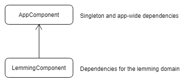

# Android Dagger 2 Tutorial

This guide explains how to use Dagger 2 in Android.
I will go through the simple setup, 
explain what the dependency graphs are and how to provide custom annotations.

You can find the final code in my GitHub repository:

[https://github.com/matthiasbruns/android-dagger2-tutorial](https://github.com/matthiasbruns/android-dagger2-tutorial)

## Project Setup

I use Android Studio 3 Canary 7 in this tutorial.

In this tutorial we will use the following libraries:

* Dagger 2 [https://github.com/google/dagger](https://github.com/google/dagger)

The resulting build.gradle can be found here:

[https://github.com/matthiasbruns/android-dagger2-tutorial/blob/master/app/build.gradle](https://github.com/matthiasbruns/android-dagger2-tutorial/blob/master/app/build.gradle)

Since we use the annotationProcessor, be sure to activate "Annotation Processing" in Android Studio.

## Intro

This guide is all about Dagger. To show you some advantages which come with dependency injection,
I created some fake app model. We will have a LemmingsRepository, which *loads* Lemmings from somewhere.
We will also have a Lemming model, which stores the lemming data. 

## Lemming

````kotlin
/**
 * Simple pojo which stores some lemming data
 */
public class Lemming {

    /**
     * Age of the lemming in years
     */
    private int mAge;

    /**
     * Id of the lemming provided by the data store
     */
    private int mId;

    /**
     * Yes - lemmings have names
     */
    private String mName;

    /**
     * How fast can you go?
     */
    private int mSpeed;
    
    // Getters & Setters
}
````

A simple pojo which stores data of a lemming in a class.

## LemmingRepository

A repository is a source of data. You can provide an interface of a repository and implement as many 
repositories as you want. 

This example is incomplete and does not provide ways to handle asynchronous datasources as REST endpoints.

If you want to know more about repositories and how to implement them correctly, have a look at my other guide:

[https://medium.com/@mtrax/android-kotlin-clean-architecture-with-mvpvm-6c46e3c92a60](https://medium.com/@mtrax/android-kotlin-clean-architecture-with-mvpvm-6c46e3c92a60)

We will _implement_ two repositories:

* LemmingCacheRepository
* LemmingRestRepository

````kotlin
/**
 * Simple interface to provide the implementation of the repository pattern.
 * THIS IS A SIMPLIFIED VERSION OF A REPOSITORY!
 * EVERYTHING WILL EXECUTE SYNCHRONOUSLY!
 */
public interface Repository<T, ID> {

    /**
     * Loads all objects of T
     */
    List<T> all();

    /**
     * Delets T by id if present
     */
    void delete(@NonNull final ID id);

    /**
     * Loads an object of T by its id if present
     */
    @Nullable
    T get(@NonNull final ID id);

    /**
     * Stores T in the datasource
     */
    void insert(@NonNull final T t);

    /**
     * Updates T by its id in the datasource
     */
    void update(@NonNull final T t);
}
````

The Repository is a base interface which allows implementing classes to define the model and id class.
It provides the usual CRUD operations.

````kotlin
/**
 * The base interface which can be implemented to provide access to lemming data.
 */
public interface LemmingRepository extends Repository<Lemming, Integer> {
}
````

The LemmingRepository defines the datatypes of the model and id generics.

````kotlin
/**
 * The LemmingCacheRepository uses stores lemmings in memory.
 */
public class LemmingCacheRepository implements LemmingRepository {

    /**
     * Our Cache.
     */
    @SuppressLint("UseSparseArrays")
    private Map<Integer, Lemming> mLemmingHashMap = new HashMap<>();

    /**
     * Gets all lemmings from the cache
     */
    @Override
    public List<Lemming> all() {
        return new ArrayList<>(mLemmingHashMap.values());
    }

    /**
     * Deletes a lemming by its id from the cache.
     */
    @Override
    public void delete(@NonNull final Integer integer) {
        mLemmingHashMap.remove(integer);
    }

    /**
     * Returns the lemming by its id.
     */
    @Override
    @Nullable
    public Lemming get(@NonNull final Integer integer) {
        return mLemmingHashMap.get(integer);
    }

    /**
     * Adds a new lemming into the cache
     */
    @Override
    public void insert(@NonNull final Lemming lemming) {
        mLemmingHashMap.put(lemming.getId(), lemming);
    }

    /**
     * Updates a cached lemming by its id
     */
    @Override
    public void update(@NonNull final Lemming lemming) {
        // Cheap - I know - is enough for this example
        mLemmingHashMap.put(lemming.getId(), lemming);
    }
}
````

The LemmingCacheRepository implements the LemmingRepository and stores the lemming data in memory.
Again - don't expect that this implementation is good or working - it is just an example.

````java
/**
 * This lemming repository communicates with a rest service.
 */
public class LemmingRestRepository implements LemmingRepository {

    /**
     * Example object
     */
    private static final Lemming LEMMING = new Lemming();

    /**
     * Loads all lemmings from the rest service.
     */
    @Override
    public List<Lemming> all() {
        return new ArrayList<>();
    }

    /**
     * Deletes a lemming from the rest service.
     */
    @Override
    public void delete(@NonNull final Integer integer) {
        // do something online
    }

    /**
     * Returns a lemming by its id from the rest service.
     */
    @Nullable
    @Override
    public Lemming get(@NonNull final Integer integer) {
        return LEMMING;
    }

    /**
     * Adds a lemming to the rest service.
     */
    @Override
    public void insert(@NonNull final Lemming lemming) {
        // Send to the interwebs
    }

    /**
     * Updates a lemming by its id in the rest service
     */
    @Override
    public void update(@NonNull final Lemming lemming) {
        // Send to the interwebs
    }

    /**
     * Fills our fake lemming with data
     */
    static {
        LEMMING.setId(1);
        LEMMING.setName("FAKE");
        LEMMING.setAge(99);
        LEMMING.setSpeed(9000);
    }
}
````

The counter part to the cache repository is the LemmingRestRepository, which "communicates" with 
a rest api.


## Dagger 2

Let's start to prepare the dependency graph. But what is the dependency graph?
Dagger has no predefined structure and inheritence rules. You as a developer can decide which 
components depend on other components, what dependencies live the lifetime of an app and which should
be recreated each injection.

